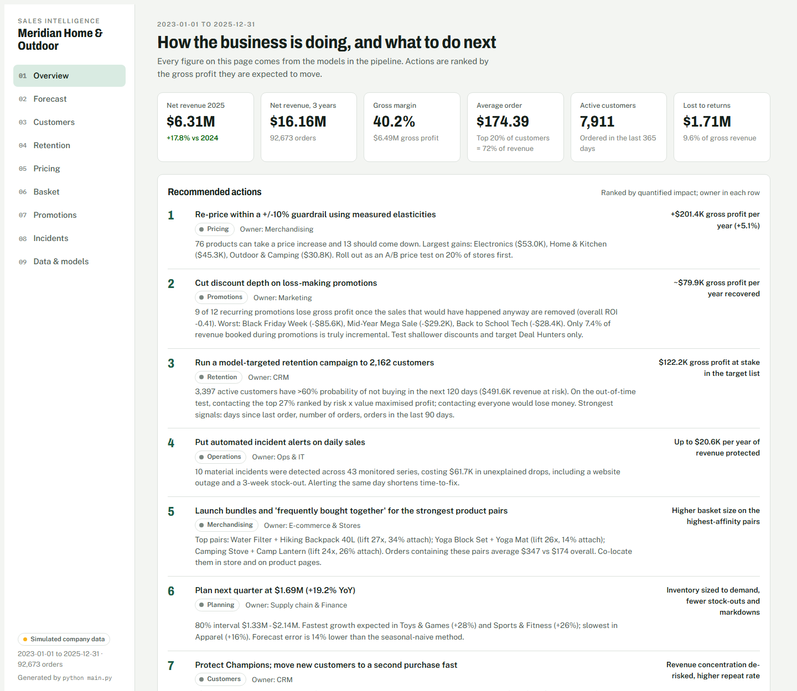
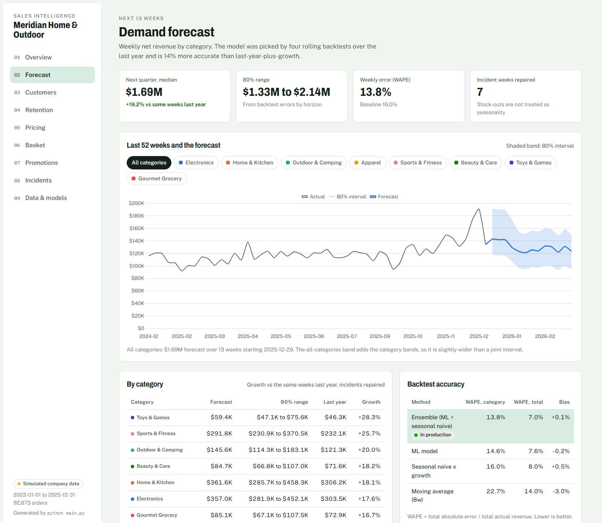
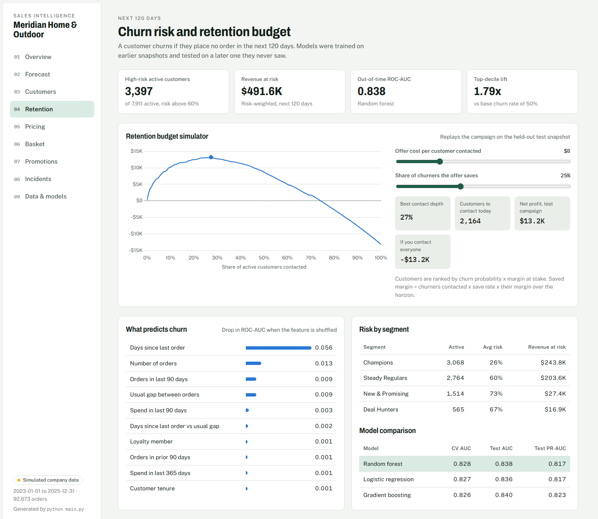
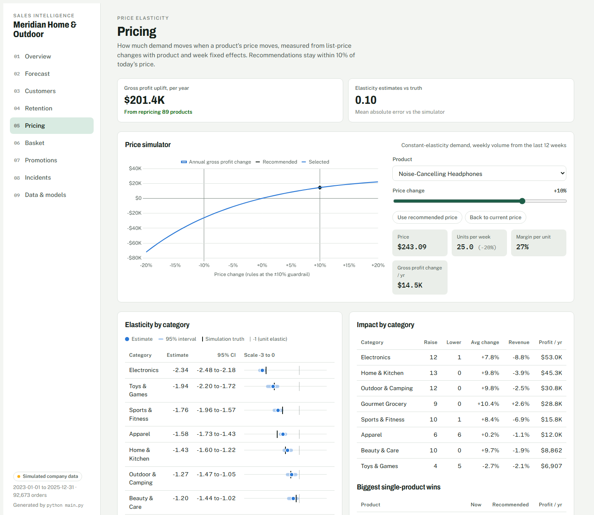
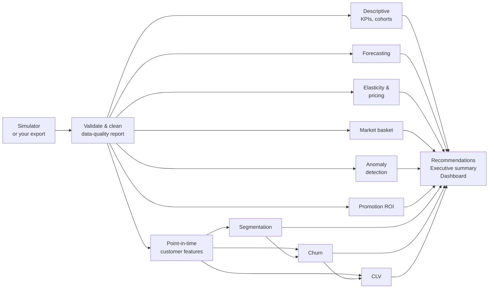

# Sales Intelligence ML

[](https://github.com/ybamiemub2hkbu/sales-intelligence-ml/actions/workflows/ci.yml)
 

**From three years of raw sales transactions to a ranked list of business decisions, each with a dollar value attached.**

This project takes the transaction export of a multi-channel retailer (stores, website and mobile app; 8 categories, 89 products, 13k customers, 204k order lines) and runs it through eight machine-learning and statistical modules. Each answers a question a leadership team actually asks. The output is not a pile of metrics. It is an auto-generated [executive summary](reports/EXECUTIVE_SUMMARY.md) with ranked, quantified recommendations, plus an interactive dashboard with what-if simulators.



> **Live dashboard:** open [`reports/dashboard/index.html`](reports/dashboard/index.html) in a browser after cloning, or enable GitHub Pages (Settings → Pages → `main` / `/docs`) to host [`docs/index.html`](docs/index.html).

---

## Questions this project answers

| Business question | Method | Decision it drives |
|---|---|---|
| How much will we sell next quarter, by category? | Global gradient-boosted forecaster + seasonal baseline ensemble, rolling-origin backtests, empirical prediction intervals | Inventory, staffing and budget |
| Who are our customers, really? | RFM+ behavioural features, K-Means (k by silhouette), automatic segment naming | Segment playbooks |
| Who is about to stop buying, and is it worth trying to keep them? | Churn classifiers (logistic, random forest, gradient boosting) on stacked snapshots, out-of-time test, profit-curve targeting | Retention campaign size and target list |
| What is each customer worth over the next 6 months? | Tweedie GLM vs Poisson gradient boosting vs finance run-rate rule | Value × risk action matrix |
| Are our prices right? | Two-way fixed-effects price elasticity with week-clustered bootstrap, constant-elasticity profit optimisation with guardrails | Price changes per product |
| What sells together? | Market-basket association rules (support, confidence, lift) at product and category level | Bundles, cross-sell, store layout |
| Did something go wrong yesterday? | Per-series expected-sales models, month-blocked out-of-fold residuals, robust z-scores, Isolation Forest | Incident alerts |
| Do our promotions make money? | Counterfactual demand model trained on non-promoted days; incremental profit, post-event dip, ROI | Which promotions to scale, fix or stop |

## Headline results

| Area | Result |
|---|---|
| Business | $16.16M net revenue over 3 years, **+17.8% YoY** in 2025, 40.2% gross margin, AOV $174 |
| Forecasting | Ensemble WAPE **13.8%** vs 16.0% for seasonal-naive-with-growth (**−14% error**). Next quarter: **$1.69M** (80% interval $1.33M–$2.14M) |
| Segmentation | **Champions are 23% of customers and 70% of revenue**; 40% of the base has lapsed (no order in 12 months) |
| Churn | Random forest, **out-of-time ROC-AUC 0.838**, top-decile lift 1.79×. Contacting the top 27% maximises campaign profit; contacting everyone loses money |
| CLV | Poisson gradient boosting cuts error **10%** vs the run-rate rule (Spearman 0.63 vs 0.53) |
| Pricing | Elasticities from −0.74 (Gourmet Grocery) to −2.34 (Electronics). Guard-railed repricing: **+$201K gross profit / year (+5.1%)** |
| Basket | 68% of orders have 2+ products; 44 strong rules (lift ≥ 2), e.g. tablet + sleeve at 17× lift |
| Promotions | $579K of discounts generated **−$235K incremental gross profit** (ROI −0.41). Only 7% of promo-period revenue was truly incremental |
| Incidents | 10 material incidents across 43 monitored series, led by a 3-week stock-out (−$25K) and a website outage |

### The top three recommendations (from the generated report)

1. **Re-price within a ±10% guardrail** using measured elasticities: +$201K gross profit per year. 76 products can take an increase, 13 should come down.
2. **Cut discount depth on loss-making promotions**: 9 of 12 recurring events lose money once baseline sales are removed. Black Friday Week alone is −$86K over three years.
3. **Run a model-targeted retention campaign** to 2,162 customers ranked by churn risk × margin at stake: $122K of gross profit in play.

See all eight, with owners and evidence, in [`reports/EXECUTIVE_SUMMARY.md`](reports/EXECUTIVE_SUMMARY.md).

## The dashboard

A single self-contained HTML file (no server) generated by the pipeline. Nine views: Overview, Forecast, Customers, Retention, Pricing, Basket, Promotions, Incidents, and Data & models. Light and dark themes, works on phones.

| Forecast explorer | Retention budget simulator | Price simulator |
|---|---|---|
|  |  |  |

* **Retention simulator:** move the offer cost and save rate; the profit curve and the best number of customers to contact recompute live from the churn model's out-of-time predictions.
* **Price simulator:** pick any product and drag its price; units, margin and annual gross-profit change follow from its category's estimated elasticity.
* **Customer lookup:** search any active customer to see segment, churn risk, predicted 180-day value and recommended action.

## Pipeline



## Quick start

```bash
git clone https://github.com/ybamiemub2hkbu/sales-intelligence-ml.git
cd sales-intelligence-ml
python -m venv .venv && source .venv/bin/activate   # Windows: .venv\Scripts\activate
pip install -r requirements.txt

python main.py                 # full run, about 5 minutes on a laptop
python main.py --fast          # quicker models
python main.py --steps churn clv report dashboard   # re-run selected steps
pytest                         # 15 tests
```

Outputs:

* `reports/EXECUTIVE_SUMMARY.md`: the auto-written report
* `reports/dashboard/index.html`: the interactive dashboard (also copied to `docs/index.html`)
* `reports/figures/`: 17 static charts
* `reports/tables/`: every number as CSV (forecasts, segment and churn scores per customer, price recommendations, bundle list, incident log, promotion scorecard)
* `reports/results/`: machine-readable JSON per module

## Project structure

```
├── main.py                     # CLI: runs the pipeline end to end
├── salesml/
│   ├── config.py               # every tunable number and business assumption
│   ├── data/
│   │   ├── generator.py        # realistic sales simulator (personas, promos, elasticity, incidents)
│   │   └── cleaning.py         # validation, fixes and data-quality report
│   ├── features.py             # leakage-safe point-in-time customer features
│   ├── analysis/descriptive.py # KPIs, YoY, channel mix, cohorts, concentration, returns, ABC
│   ├── models/
│   │   ├── forecasting.py      # weekly category forecast + backtests + intervals
│   │   ├── segmentation.py     # RFM+ K-Means with auto-naming and playbooks
│   │   ├── churn.py            # churn models, out-of-time test, profit-curve targeting
│   │   ├── clv.py              # 180-day CLV and value x risk matrix
│   │   ├── elasticity.py       # fixed-effects elasticity, bootstrap CIs, pricing
│   │   ├── basket.py           # association rules and bundles
│   │   ├── anomaly.py          # incident detection and log
│   │   └── promotions.py       # counterfactual promotion ROI
│   ├── reporting.py            # recommendations + executive summary
│   ├── dashboard.py            # builds the HTML dashboard
│   ├── templates/dashboard.html
│   └── viz.py                  # one colour-blind-safe chart style for every figure
├── tests/                      # pytest suite
├── reports/                    # generated outputs (committed so you can browse them)
├── docs/                       # methodology, dashboard for GitHub Pages, screenshots
└── data/sample/                # 2,000-row sample of the transaction export
```

## About the data

Real transaction data is confidential, and public retail datasets rarely combine prices, promotions, returns, channels and full customer histories. So the project ships with a **simulator** of a fictional retailer, *Meridian Home & Outdoor*, that encodes the mechanisms real sales data has:

* five hidden customer personas with different purchase rates, basket sizes, promotion sensitivity and lifetimes, with engagement fading before a customer churns
* growth from acquisition, a shift from stores to the mobile app, weekly / yearly / holiday / category seasonality
* a promotion calendar (including next year's planned events) that lifts traffic, shifts category mix and pulls demand forward
* product-level list-price changes with constant-elasticity demand
* products that are bought together, returns that depend on category, channel and discount depth
* four operational incidents (website outage, viral product spike, supply stock-out, regional storm)
* dirty records: duplicates, missing channels, negative quantities, prices keyed in cents

The full raw data (20 MB) is regenerated deterministically by `python main.py --steps generate`; a sample is in [`data/sample/`](data/sample).

### Checking the models against the truth

Because the data is simulated, the true mechanisms are known (`data/raw/ground_truth.json`). They are **never used by a model**, only to grade the models afterwards:

| Check | Result |
|---|---|
| Price elasticity | Mean absolute error 0.10; the 95% CI covers the true value in 7 of 8 categories |
| Market basket | All 16 planted product affinities appear in the top 40 rules |
| Anomaly detection | 2 of 4 planted incidents alerted (outage, stock-out). The viral spike peaks at z = 3.4 on the right product, just under the 3.5 alert line; the 3-day regional storm is lost in daily noise |
| Data cleaning | Every injected duplicate, sign error, cents error and missing channel is fixed and counted |

## Using your own data

Replace the generator step with your export. `salesml/data/cleaning.py` expects a line-level table with:

`order_id, line_number, order_date, customer_id, product_id, category, channel, region, quantity, list_price, discount_pct, unit_price, unit_cost, is_returned, promo_id`

plus `customers.csv` (`customer_id, region, age_band, loyalty_member, …`), `products.csv` (`product_id, product_name, category, unit_cost, current_list_price`) and `promotions.csv` (`promo_id, promo_name, start_date, end_date, discount_pct, categories`). Put them in `data/raw/` and run `python main.py --steps clean descriptive forecast segment churn clv elasticity basket anomaly promotions report dashboard`.

## Design choices worth knowing

* **No leakage.** Customer features only see transactions strictly before the snapshot date; churn and CLV are tested on a later snapshot whose outcome window never overlaps training labels.
* **Baselines everywhere.** Each model is compared with what a planner, finance team or CRM manager would do without ML: seasonal naive, run-rate CLV, random targeting.
* **Decisions, not just scores.** Churn becomes a contact list sized by a profit curve; elasticity becomes guard-railed prices; promotions become a scorecard against a counterfactual.
* **Honest uncertainty.** Forecast intervals come from backtest errors, elasticities carry bootstrap CIs, and detections that miss are reported as misses.

Full details: [`docs/METHODOLOGY.md`](docs/METHODOLOGY.md).

## Limitations

* The company is simulated. The methods transfer to real data, but these specific numbers do not describe any real business.
* Elasticities are within-category substitution elasticities from single-product price moves. A category-wide price change would behave differently.
* Promotion halo effects on non-promoted categories are not credited (conservative), and customer-acquisition value of promotions is not modelled.
* Daily granularity limits detection of short, local incidents.

## Tech

Python 3.10+, pandas, NumPy, scikit-learn, SciPy, Matplotlib; Chart.js in the dashboard. No GPU, no external services.

## License

MIT. See [LICENSE](LICENSE).
