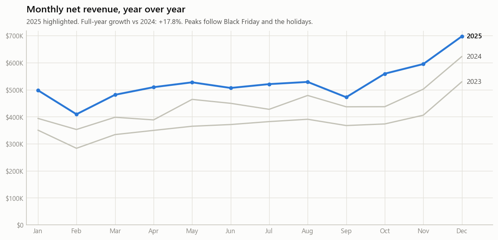
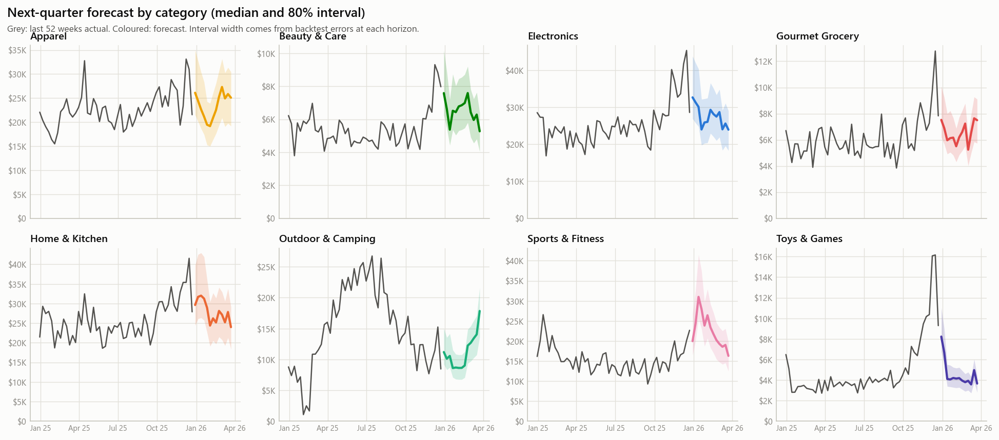
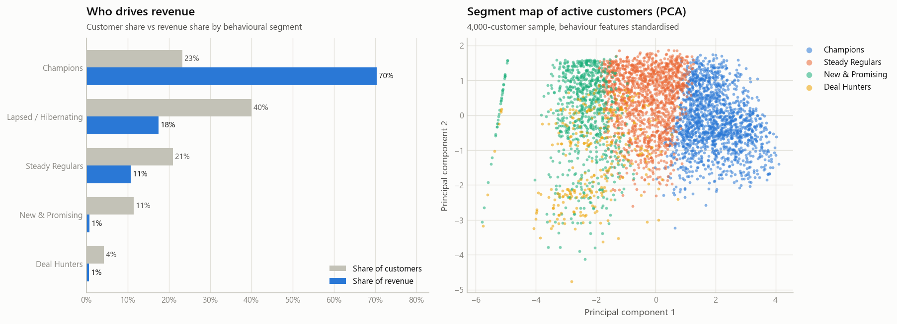
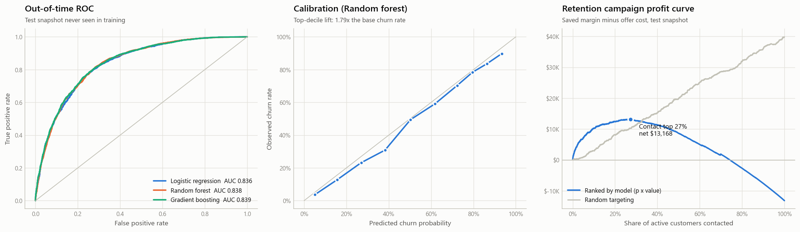
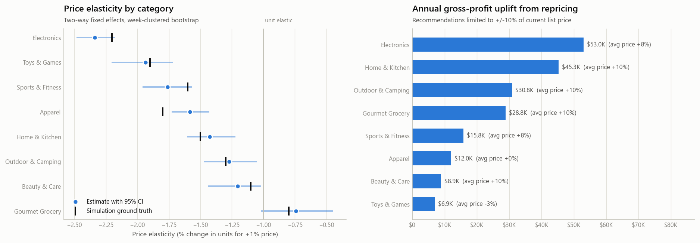
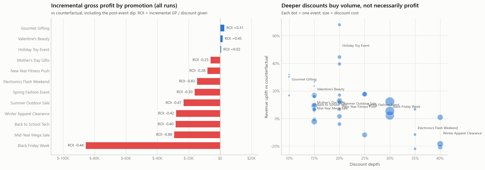
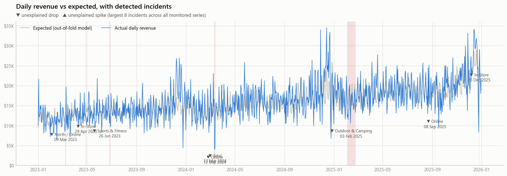

# Executive Summary - Meridian Home & Outdoor

*Auto-generated by `python main.py` on 2026-10-01 from 92,673 orders, 2023-01-01 to 2025-12-31. Company and data are simulated (see README).*

## The business at a glance

| Metric | Value |
|---|---|
| Net revenue (3 years) | **$16.16M** |
| Net revenue 2025 | $6.31M (+17.8% YoY) |
| Gross margin | 40.2% |
| Orders / customers | 92,673 / 13,177 |
| Average order value | $174.39 |
| Active customers (last 365 days) | 7,911 |
| Revenue lost to returns | $1.71M (9.6%) |
| Top 20% of customers' share of revenue | 72% |

## Recommended actions (ranked by quantified impact)

### 1. Re-price within a +/-10% guardrail using measured elasticities
**Owner:** Merchandising · **Impact:** +$201.4K gross profit per year (+5.1%)

76 products can take a price increase and 13 should come down. Largest gains: Electronics ($53.0K), Home & Kitchen ($45.3K), Outdoor & Camping ($30.8K). Roll out as an A/B price test on 20% of stores first.

### 2. Cut discount depth on loss-making promotions
**Owner:** Marketing · **Impact:** ~$79.9K gross profit per year recovered

9 of 12 recurring promotions lose gross profit once the sales that would have happened anyway are removed (overall ROI -0.41). Worst: Black Friday Week (-$85.6K), Mid-Year Mega Sale (-$29.2K), Back to School Tech (-$28.4K). Only 7.4% of revenue booked during promotions is truly incremental. Test shallower discounts and target Deal Hunters only.

### 3. Run a model-targeted retention campaign to 2,162 customers
**Owner:** CRM · **Impact:** $122.2K gross profit at stake in the target list

3,397 active customers have >60% probability of not buying in the next 120 days ($491.6K revenue at risk). On the out-of-time test, contacting the top 27% ranked by risk x value maximised profit; contacting everyone would lose money. Strongest signals: days since last order, number of orders, orders in the last 90 days.

### 4. Put automated incident alerts on daily sales
**Owner:** Ops & IT · **Impact:** Up to $20.6K per year of revenue protected

10 material incidents were detected across 43 monitored series, costing $61.7K in unexplained drops, including a website outage and a 3-week stock-out. Alerting the same day shortens time-to-fix.

### 5. Launch bundles and 'frequently bought together' for the strongest product pairs
**Owner:** E-commerce & Stores · **Impact:** Higher basket size on the highest-affinity pairs

Top pairs: Water Filter + Hiking Backpack 40L (lift 27x, 34% attach); Yoga Block Set + Yoga Mat (lift 26x, 14% attach); Camping Stove + Camp Lantern (lift 24x, 26% attach). Orders containing these pairs average $347 vs $174 overall. Co-locate them in store and on product pages.

### 6. Plan next quarter at $1.69M (+19.2% YoY)
**Owner:** Supply chain & Finance · **Impact:** Inventory sized to demand, fewer stock-outs and markdowns

80% interval $1.33M - $2.14M. Fastest growth expected in Toys & Games (+28%) and Sports & Fitness (+26%); slowest in Apparel (+16%). Forecast error is 14% lower than the seasonal-naive method.

### 7. Protect Champions; move new customers to a second purchase fast
**Owner:** CRM · **Impact:** Revenue concentration de-risked, higher repeat rate

Champions are 23% of customers but 70% of revenue. 1,514 New & Promising customers have bought once; a 30-day onboarding journey is the cheapest lever to convert them into regulars.

### 8. Fix online returns in Apparel
**Owner:** Product & E-commerce · **Impact:** Lower reverse-logistics cost, higher net revenue

Online Apparel return rate is 22.8% vs 16.9% in store; returns erased $1.71M of revenue overall. Better size guides, fit reviews and photos target the gap.

## What the models found

### Demand forecast - next quarter
* Production method: **Ensemble (ML + seasonal naive)**, chosen by 4 rolling-origin backtests (category-week WAPE 13.8% vs 16.0% seasonal-naive).
* Next 13 weeks: **$1.69M** (80% interval $1.33M-$2.14M), +19.2% vs the same weeks last year.
* 7 incident weeks (e.g. the February stock-out) were repaired before training so they are not mistaken for seasonality.

### Customer segments
| Segment | Customers | Revenue share | Median orders | Action |
|---|---|---|---|---|
| Champions | 3,068 | 70% | 15 | Protect: VIP early access, loyalty tier upgrades, no blanket discounts needed. |
| Lapsed / Hibernating | 5,266 | 18% | 1 | One win-back attempt with a time-boxed offer; suppress from paid media if no response. |
| Steady Regulars | 2,764 | 11% | 3 | Grow basket: cross-sell from basket rules, subscribe-and-save on consumables. |
| New & Promising | 1,514 | 1% | 1 | Second-purchase journey within 30 days: onboarding series + category recommendation. |
| Deal Hunters | 565 | 1% | 1 | Monetise promos: target with event previews, steer to high-margin bundles, cap discount depth. |

### Churn and lifetime value
* Churn model (**Random forest**): out-of-time ROC-AUC **0.838**, top-decile lift **1.79x**; base churn rate 50.1%.
* CLV model (**Gradient boosting (Poisson)**): MAE 10% lower than the run-rate heuristic; the top 10% of predicted customers deliver 39% of next-180-day revenue.
* Value x risk: **87** high-value customers at elevated risk (personal outreach), 1,891 high-value / low-risk customers hold 63% of predicted value.

### Pricing
| Category | Elasticity (95% CI) | Profit uplift / yr |
|---|---|---|
| Electronics | -2.34 (-2.48 to -2.18) | $53.0K |
| Toys & Games | -1.94 (-2.20 to -1.72) | $6,907 |
| Sports & Fitness | -1.76 (-1.96 to -1.57) | $15.8K |
| Apparel | -1.58 (-1.73 to -1.43) | $12.0K |
| Home & Kitchen | -1.43 (-1.60 to -1.22) | $45.3K |
| Outdoor & Camping | -1.27 (-1.47 to -1.05) | $30.8K |
| Beauty & Care | -1.20 (-1.44 to -1.02) | $8,862 |
| Gourmet Grocery | -0.74 (-1.02 to -0.45) | $28.8K |

### Basket, promotions, incidents
* 68% of orders contain 2+ products; 44 strong rules (lift >= 2).
* Promotions: $579.2K of discounts generated -$234.9K incremental gross profit (ROI -0.41). Best: Valentine's Beauty. Worst: Mid-Year Mega Sale.
* Anomaly detection: 10 material incidents across 43 series.

## Validation against simulation ground truth
Because the data is simulated, we know the true mechanisms and can check whether the models recover them:

* **Price elasticity:** mean absolute error 0.10; the 95% CI covers the true value in 88% of categories.
* **Market basket:** 16 of 16 planted product affinities appear among the top 40 rules.
* **Anomalies:** 2 of 4 planted incidents raised an alert:
  * website_outage (2024-03-12 to 2024-03-13): detected - strongest signal Channel: Online at |z| = 4.4
  * viral_social_post (2024-09-18 to 2024-09-21): not alerted - strongest signal Product: Wireless Earbuds at |z| = 3.4
  * supply_stockout (2025-02-03 to 2025-02-23): detected - strongest signal Category: Outdoor & Camping at |z| = 6.3
  * regional_storm (2025-01-15 to 2025-01-17): not alerted - strongest signal Category: Beauty & Care at |z| = 3.3

*See `reports/tables/` for every number above and `docs/METHODOLOGY.md` for the methods.*
